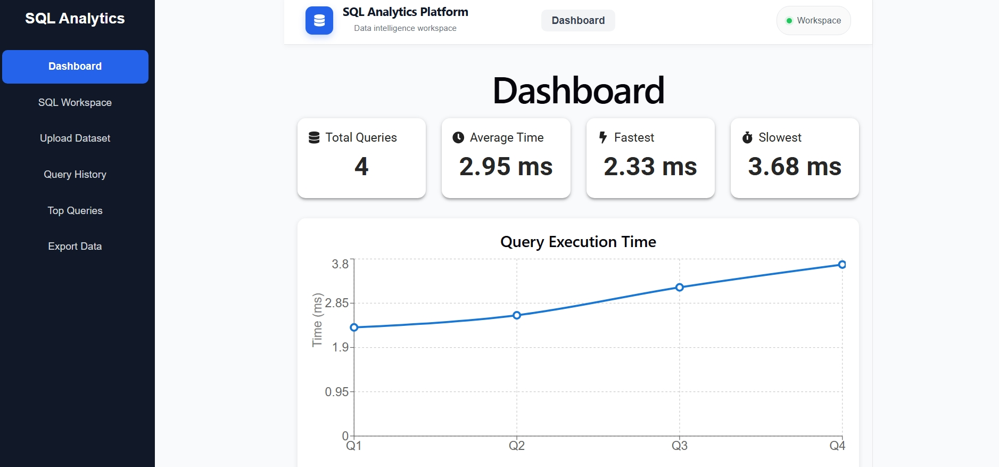
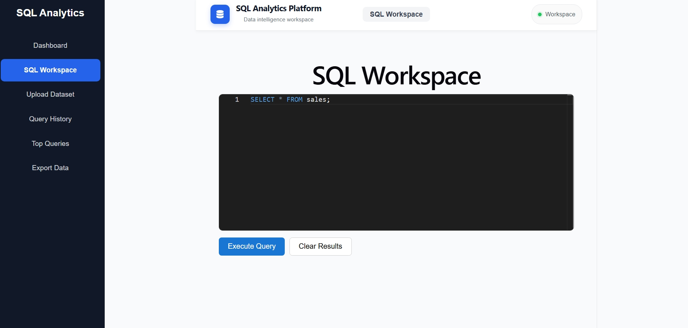
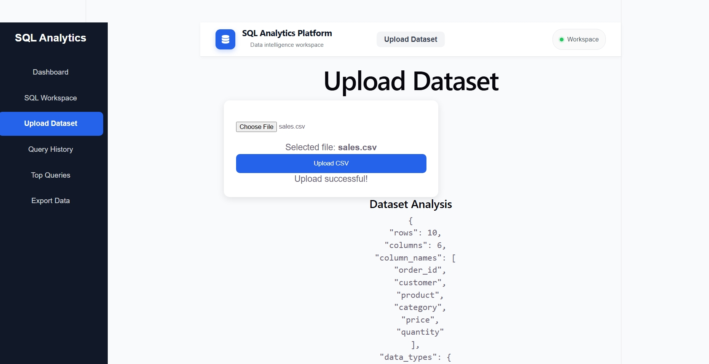
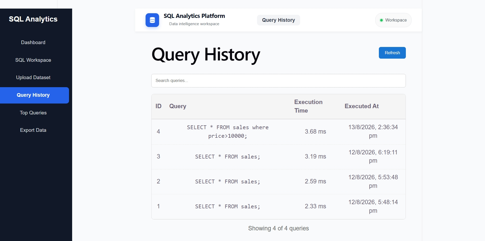
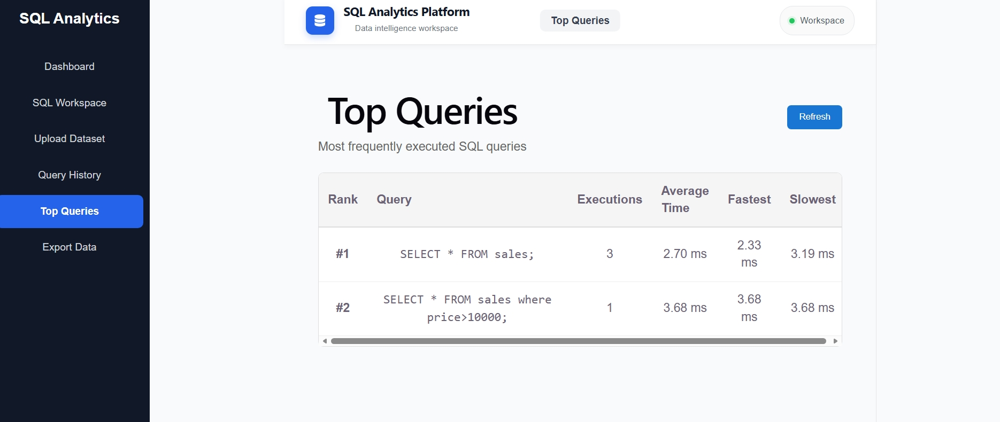
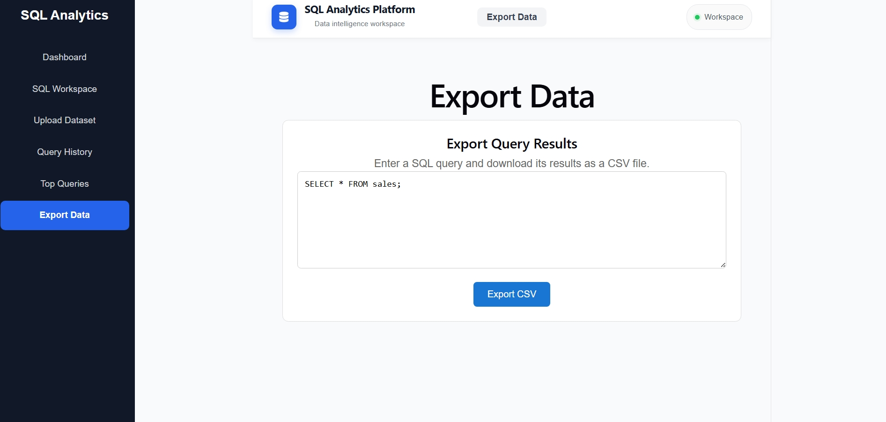

# 🚀 SQL Analytics Platform

A full-stack SQL analytics platform for uploading and analyzing CSV datasets, executing SQL queries, tracking query performance, viewing query history, and exporting query results.

The platform is built with **React + TypeScript**, **FastAPI**, **PostgreSQL**, **SQLAlchemy**, and **Pandas**, and is deployed using **Render**.

## 🌐 Live Demo

**Frontend:**  
https://sql-analytics-frontend.onrender.com

**Backend API:**
https://sql-analytics-platform-x6e2.onrender.com

**Swagger API Documentation:**!
https://sql-analytics-platform-x6e2.onrender.com/docs
---

## ✨ Features

### 📊 Dashboard
- Total query count
- Average query execution time
- Fastest query
- Slowest query
- Query execution-time visualization
- Recent query activity
- Top/slowest queries

### 🧑‍💻 SQL Workspace
- Interactive SQL editor powered by Monaco Editor
- SQL syntax highlighting
- Execute queries through the FastAPI backend
- Display query results in a table
- Display execution time
- SQL error handling

### 📁 CSV Analysis
- Upload CSV datasets
- Process datasets using Pandas
- Generate dataset analysis
- Display analysis results through the frontend

### 📝 Query History
- Store executed queries
- Store query execution time
- View previous queries
- Search query history

### 📈 Query Analytics
- Track query execution performance
- Identify frequently executed queries
- Identify slow queries
- Visualize query performance

### 📤 Export
- Execute SQL queries
- Export query results as CSV

### 🚀 Deployment
- Production frontend deployed on Render
- Production FastAPI backend deployed on Render
- PostgreSQL database
- Production environment variables
- React Router SPA rewrite configuration

---

## 🛠️ Tech Stack

### Frontend

- React
- TypeScript
- Vite
- Material UI
- Axios
- Recharts
- Monaco Editor
- React Router
- React Icons

### Backend

- Python
- FastAPI
- SQLAlchemy
- Pandas
- Uvicorn
- Python-dotenv

### Database

- PostgreSQL

### Development Tools

- Git
- GitHub
- pgAdmin
- VS Code

### Deployment

- Render

---

## 🏗️ Architecture

```text
                    ┌─────────────────────────┐
                    │      React Frontend     │
                    │                         │
                    │ React + TypeScript      │
                    │ Vite + MUI              │
                    │ Monaco Editor           │
                    │ Recharts                │
                    └────────────┬────────────┘
                                 │
                                 │ REST API
                                 ▼
                    ┌─────────────────────────┐
                    │     FastAPI Backend     │
                    │                         │
                    │ Query Service           │
                    │ CSV Analysis Service    │
                    │ Export Service           │
                    │ Query History           │
                    └────────────┬────────────┘
                                 │
                                 ▼
                    ┌─────────────────────────┐
                    │       PostgreSQL        │
                    │                         │
                    │ Query History           │
                    │ Dataset Metadata        │
                    └─────────────────────────┘


## 📸 Screenshots

### 📊 Dashboard



### 🧑‍💻 SQL Workspace



### 📁 CSV Upload & Analysis



### 📝 Query History



### 🔝 Top Queries



### 📤 Export Results

